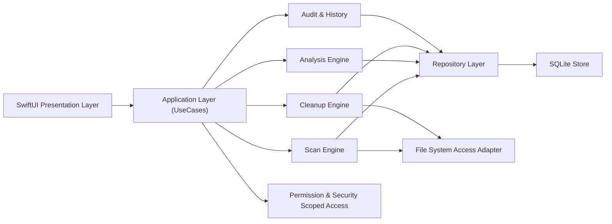

# CleanMacApp 技术架构设计（基于 PRD v1.0）

> 文档状态：架构蓝图（最后校对：2026-03-22）
>
> 说明：本文是目标架构设计，不是逐行实现文档。当前实现已落地扫描/推荐/清理/历史主链路，并做了多轮内存与取消优化；具体代码行为以 `Sources/` 与 `README.md` 为准。

## 0. 当前实现差异（相对蓝图）
1. 已落地本地 SQLite 存储与清理审计，但数据模型做了简化（未完全按本蓝图的所有字段/表展开）。
2. 权限策略当前以本地自用场景为主，采用全盘权限引导 UI + 失败回传，不依赖完整沙箱书签体系。
3. 全盘扫描为降低内存峰值，采用背压式枚举与轻量推荐聚合策略。
4. 清理成功后会即时回写索引，避免“已删除文件再次出现”。

## 1. 文档目标与范围
- 文档目标：定义可落地的 MVP 技术架构，支撑“扫描 -> 分析 -> 清理 -> 审计”完整闭环。
- 适用版本：MVP（对应 PRD 7.1）。
- 技术基线：macOS 13+，Swift 5.10+，SwiftUI，SQLite（或 CoreData+SQLite 存储后端）。

## 2. 设计原则
1. 安全优先：默认仅支持“移到回收站”，所有清理可追溯。
2. 可解释：每条建议都可回溯到文件路径、分类规则和评分依据。
3. 高性能：大目录并发扫描，低优先级执行，支持增量索引。
4. 可恢复：扫描中断、权限失败、文件占用都要可恢复和可重试。
5. 模块化：UI、扫描、分析、清理、存储、权限管理解耦。

## 3. 总体架构


## 4. 分层与模块职责
## 4.1 Presentation Layer（SwiftUI）
- 页面：概览、扫描结果、大文件、重复文件、缓存、历史、设置。
- 仅负责状态展示和用户交互，不直接操作文件系统。
- 通过 `ViewModel` 调用 `UseCase`，订阅进度事件。

## 4.2 Application Layer（UseCases）
- `StartScanUseCase`：发起扫描任务，管理任务生命周期。
- `BuildRecommendationsUseCase`：生成清理建议（大文件/重复/缓存）。
- `ExecuteCleanupUseCase`：预检查、清理执行、结果汇总。
- `LoadDashboardUseCase`：提供首页统计与趋势数据。
- 负责事务边界、幂等控制、错误映射（可读错误提示）。

## 4.3 Domain/Core Services
- `ScanEngine`
  - 目录遍历、文件元数据采集、增量检测、进度上报。
- `ClassificationService`
  - 文件类别识别（文档/媒体/压缩包/缓存/其他）。
- `DuplicateDetector`
  - 分阶段查重：先按大小分桶，再快速哈希，再全量哈希确认。
- `RecommendationService`
  - 基于规则生成建议项与风险等级（低/中/高）。
- `CleanupService`
  - 执行回收站移动、失败重试、冲突与权限错误处理。
- `AuditService`
  - 记录清理前后明细、释放空间、失败原因。

## 4.4 Infrastructure Layer
- `FileSystemAdapter`
  - 统一文件访问能力，封装 FileManager/URLResourceValues。
- `PermissionManager`
  - 按需申请权限，管理安全范围书签（Security-Scoped Bookmarks）。
- `SQLiteRepository`
  - 扫描索引、推荐结果、历史记录、配置持久化。
- `TaskScheduler`
  - 低优先级后台任务调度与取消控制。

## 5. 核心数据流
## 5.1 扫描流程
1. 用户触发扫描，`StartScanUseCase` 创建 `scan_session`。
2. `ScanEngine` 遍历目标路径，采集元数据（路径、大小、mtime、type、inode）。
3. 增量策略判断是否需要重算（mtime/size/inode 变化）。
4. 结果写入 `file_index`，并持续发送进度事件到 UI。
5. 扫描完成后触发 `BuildRecommendationsUseCase`。

## 5.2 推荐生成流程
1. 大文件规则：`size >= threshold`。
2. 重复文件规则：`size bucket -> quick hash -> full hash`。
3. 缓存规则：命中缓存目录 + 最近访问时间 + 白名单/黑名单策略。
4. 生成 `cleanup_candidate`，附带建议理由和风险等级。

## 5.3 清理执行流程
1. 用户勾选候选项，`ExecuteCleanupUseCase` 做预检查（权限、存在性、冲突）。
2. `CleanupService` 批量移动到回收站（默认）并记录结果。
3. 成功项更新状态，失败项记录错误码和建议动作。
4. `AuditService` 写入历史，返回本次释放空间与失败摘要。

## 6. 并发与性能设计
## 6.1 并发模型
- 使用 Swift Concurrency（`async/await` + `TaskGroup`）。
- 扫描采用“目录级并发 + 文件元数据批处理写入”。
- 哈希计算采用受限并发（例如按 CPU 核数设置 worker 上限）。

## 6.2 性能策略
1. 分层过滤：先扫描元数据，再对候选集做哈希，避免全量哈希。
2. 增量扫描：持久化目录快照，仅处理变化文件。
3. 批量写库：减少频繁单条事务开销。
4. I/O 限速：后台低优先级（`Utility` QoS），降低系统卡顿。
5. 快速扫描预设：仅扫描 `Desktop/Documents/Downloads/Library/Caches`。

## 7. 数据模型（SQLite）
## 7.1 主要表
- `scan_session`
  - `id`, `mode`, `scope_json`, `started_at`, `finished_at`, `status`
- `file_index`
  - `id`, `session_id`, `path`, `parent_path`, `size_bytes`, `mtime`, `atime`, `file_type`, `inode`, `quick_hash`, `full_hash`, `category`, `is_deleted`
- `duplicate_group`
  - `id`, `session_id`, `hash`, `total_size`, `file_count`
- `duplicate_item`
  - `id`, `group_id`, `file_index_id`, `is_recommended_delete`
- `cleanup_candidate`
  - `id`, `session_id`, `file_index_id`, `candidate_type`, `reason`, `risk_level`, `estimated_reclaim_bytes`, `selected`
- `cleanup_job`
  - `id`, `session_id`, `started_at`, `finished_at`, `status`, `reclaimed_bytes`
- `cleanup_result`
  - `id`, `job_id`, `file_index_id`, `action`, `result`, `error_code`, `error_message`
- `app_setting`
  - `key`, `value_json`, `updated_at`

## 7.2 关键索引
- `file_index(path)` 唯一索引（配合 `is_deleted` 逻辑处理）。
- `file_index(size_bytes, mtime)` 用于快速候选过滤。
- `file_index(full_hash)` 用于重复组查询。
- `cleanup_candidate(session_id, candidate_type, selected)` 用于 UI 列表分页。

## 8. 权限与安全架构
1. 权限策略
   - 按功能触发时申请访问权限，不在启动时一次性申请。
   - 用户选择目录后保存安全书签，后续增量扫描复用。
2. 保护策略
   - 默认黑名单：系统关键路径（如 `/System`、`/private` 的敏感区域）。
   - 清理前显示绝对路径、数量、预计释放空间。
3. 删除策略
   - MVP 仅“移动到回收站”，不直接 `unlink` 永久删除。
4. 隐私策略
   - 所有文件元数据仅本地存储，默认无外发。

## 9. 错误处理与可恢复机制
1. 扫描错误分类
   - `permission_denied`、`file_not_found`、`io_error`、`path_too_long`。
2. 清理错误分类
   - `in_use`、`permission_denied`、`already_deleted`、`unknown`。
3. 恢复策略
   - 扫描可断点续跑（按目录批次 checkpoint）。
   - 清理失败项支持“仅重试失败项”。
   - 任务取消后保持数据库一致状态（事务提交边界清晰）。

## 10. 可观测性与审计
1. 本地日志
   - `scan_started`, `scan_finished`, `candidate_generated`, `cleanup_executed`。
2. 指标埋点（本地优先）
   - 扫描耗时、候选数量、实际释放空间、失败率。
3. 审计能力
   - 每次清理可追溯到文件级记录与结果状态。

## 11. 接口草案（内部协议）
```swift
protocol ScanUseCase {
    func startScan(scope: ScanScope, mode: ScanMode) async throws -> ScanSessionID
    func cancelScan(sessionID: ScanSessionID) async
    func scanProgressStream(sessionID: ScanSessionID) -> AsyncStream<ScanProgress>
}

protocol RecommendationUseCase {
    func buildCandidates(sessionID: ScanSessionID, rules: RuleSet) async throws
    func listCandidates(sessionID: ScanSessionID, type: CandidateType) async throws -> [CleanupCandidate]
}

protocol CleanupUseCase {
    func execute(sessionID: ScanSessionID, selectedIDs: [CandidateID]) async throws -> CleanupSummary
    func retryFailed(jobID: CleanupJobID) async throws -> CleanupSummary
}
```

## 12. MVP 实施切片（建议）
1. 切片 A：扫描与索引
   - 完成扫描引擎、增量索引、进度事件。
2. 切片 B：大文件与缓存建议
   - 完成规则系统、候选列表、基础筛选排序。
3. 切片 C：重复文件检测
   - 完成两阶段哈希和分组展示。
4. 切片 D：清理执行与历史审计
   - 完成回收站清理、失败重试、历史页面。
5. 切片 E：稳定性与性能
   - 压测、异常回归、冷启动和扫描耗时优化。

## 13. 测试架构
1. 单元测试
   - 分类规则、重复检测、候选生成逻辑。
2. 集成测试
   - 扫描 -> 建议 -> 清理 -> 历史闭环。
3. 端到端测试
   - 权限首次授权流程、失败重试流程。
4. 性能测试
   - 万级文件目录扫描、重复检测耗时、UI 响应性。

## 14. 关键技术决策（ADR 简版）
1. 为什么选 SwiftUI + Swift Concurrency
   - 原生平台性能好，和 macOS 权限模型、文件 API 集成成本低。
2. 为什么选 SQLite
   - 查询能力和性能稳定，适合索引型场景与历史追踪。
3. 为什么默认回收站
   - 符合“可回滚”目标，显著降低误删风险。

## 15. 待确认架构决策
1. 分发渠道：Mac App Store 还是官网分发（影响沙箱与权限策略）。
2. 数据层：直接 SQLite 还是 CoreData 封装（影响开发效率与可控性）。
3. 重复检测哈希算法是否支持可插拔（未来可扩展更快算法）。
4. 是否在 v1 引入开发者缓存模板扫描（Xcode/Docker/Homebrew）。
